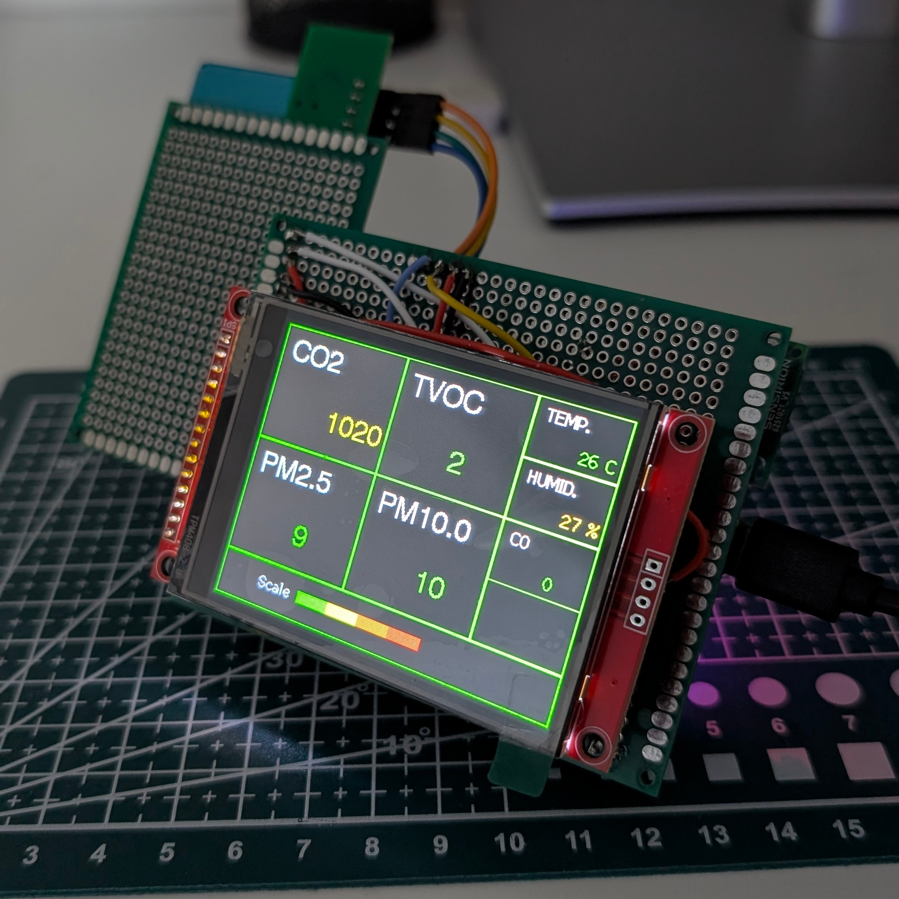
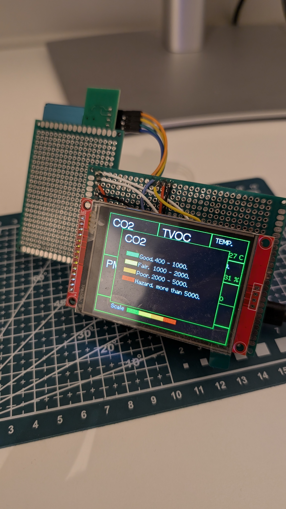
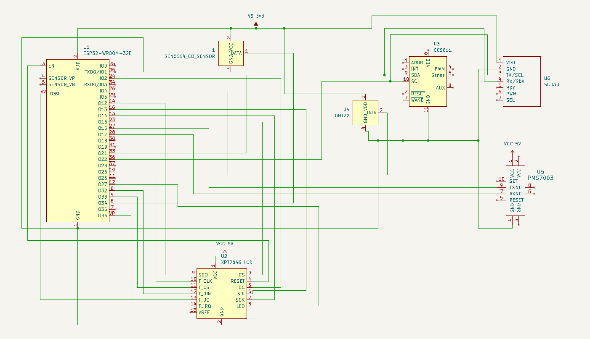

# Air Quality Monitor
This project utilizes various components to measure the surrounding air quality. All readings are displayed using color coding to indicate whether the given value is **Good**, **Fair**, **Poor**, or **Hazardous**. 
The device is capable of measuring the following parameters:

- PM2.5 (Particulate Matter)
- PM10.0 (Particulate Matter)
- CO (Carbon Monoxide,qualitative values)
- CO2 (Carbon Dioxide)
- Temperature 
- Humidity
- VOC (Volatile Organic Compounds)

Components used:
- ESP32 microcontroller from freenove
- SCD30 CO2 sensor
- Dfrobot SEN0564 CO qualitative sensor
- ccs811 TVOC sensor
- PM7003 Particulate meter
- DHT22 Temperature & Humidity sensor
- 2.8 inch SPI touch screen
- 3.3V regulator from  amazon
- USB C breakout board to get the power

Powered on with all the components

When you touch the screen in a readings box its gives the legend about the displayed values

Components on the prototype board

Schematic Diagram

